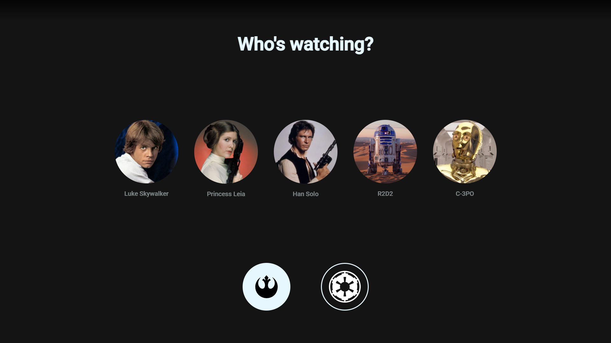
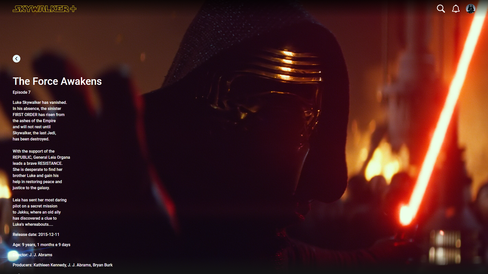
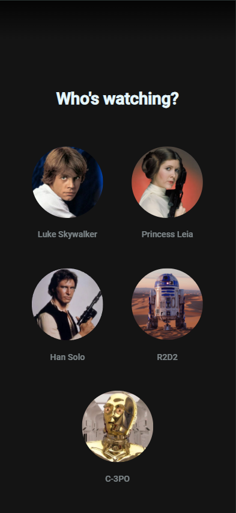
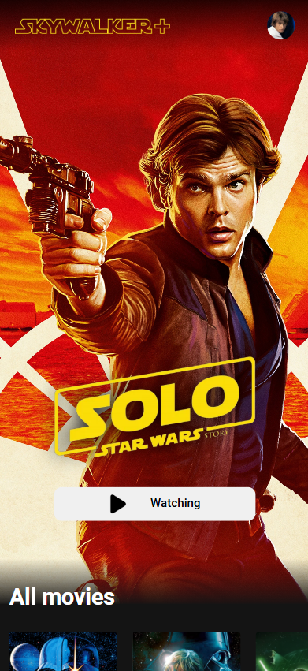

<div style="text-align: center;margin-bottom:50px">
  
</div>

# 💬 Teste para empresa L5

Gostaria de expressar minha gratidão pela oportunidade de participar do processo seletivo para a vaga de desenvolvedor na L5. É uma honra poder apresentar meu trabalho e habilidades a uma empresa tão reconhecida no mercado.

A experiência de participar desse processo tem sido enriquecedora, e a forma como a L5 conduz o recrutamento reflete os valores e a excelência que a empresa transmite.

Independente do resultado, agradeço pela confiança e pelo tempo dedicado à análise do meu perfil. Estou à disposição para esclarecer qualquer informação adicional ou participar de etapas futuras.

## 📂 Estrutura do Projeto

- `src/`: Css, imagens e elementos que serão usados em uma ou mais páginas. Ex: Navbar
- `docs/`: Documentação detalhada.
- `sql/`: Dump da base de dados do projeto.
- `backend/`: Todo código fonte do backend do projeto.
- `backend/api`: Todo código fonte da API criada para consumir a SWAPI.
- `backend/classes`: Todas as classes do projeto, usadas para mostrar filmes, selecionar informações no banco e etc.

## 🚀 Como Usar

1. Clone o repositório:
   ```bash
   git clone https://github.com/seu-usuario/nome-do-repo.git
   cd nome-do-repo


## 🛠️ Tecnologias Utilizadas

- **Frontend**:  
  - [Bootstrap](https://getbootstrap.com/): Usado para alguns ajustes de tela.
  - [Jquery](https://jquery.com/): Usado para animações e manipulação de elementos.
  - [Fontawesome](https://fontawesome.com/): Usado para icones na página (Foi usado uma única vez para voltar para páginas)

## 💻 Telas do projeto (Computador)

 ### Login

 

 ### Index

 

 ### Filme

 

## 📱 Telas do projeto (Celular)

 ### Login

 

 ### Index

 

 ### Filme

 

## ✨ Recursos adicionados
- Na aba menu (Index) todo filme tem um trecho que é passado logo quando a página é carrregada.
- Por padrão navegadores não deixam vídeos serem iniciados com som, por isso quando o trecho do filme é passado o usuário tem a opção de ativar o som.
- Todas as imagens e vídeos de filmes são carregadas via banco de dados.
- Sistema de login baseado em grandes plataformas de streaming (Principal inspiração foi a Netflix).

## 🙏 Agradecimentos

Agradeço à **L5** pela oportunidade de trabalhar neste projeto e ao Desenvolvedor **Marcel Maretti** pelo suporte ao longo do desenvolvimento.  

## 👤 Criado por

**Vitor Rotelli**  
[Site](https://vitorrotelli.com/) | [LinkedIn](https://www.linkedin.com/in/vitor-de-fran%C3%A7a-rotelli-b7b530231/)
